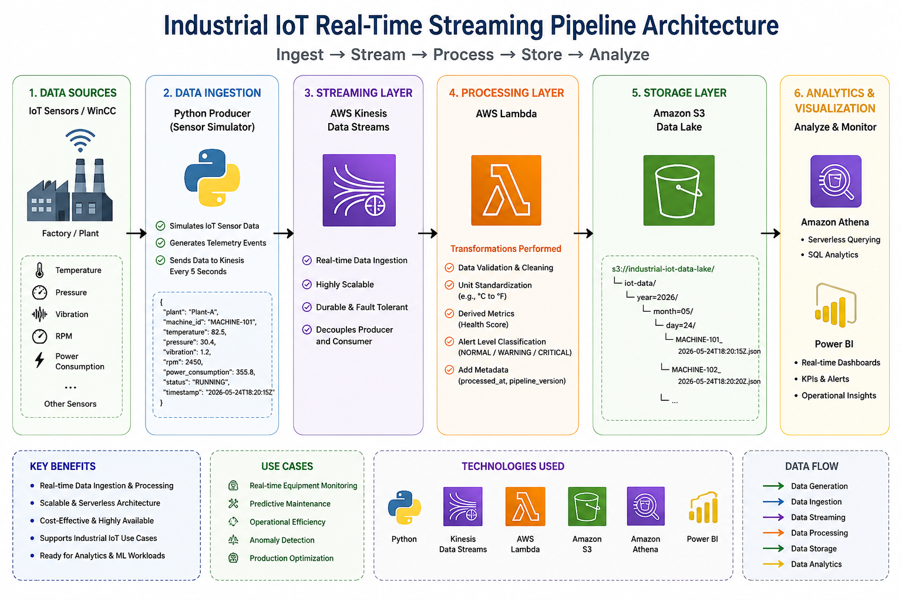

# Industrial IoT Real-Time Streaming Pipeline

## Overview

This project simulates a real-time industrial IoT streaming architecture where machine telemetry data is continuously generated from factory equipment and streamed into AWS cloud services for analytics and monitoring.

The pipeline uses AWS Kinesis for real-time ingestion, AWS Lambda for event processing, and Amazon S3 as a scalable cloud data lake.

---

## Architecture



*Figure:Industrial IoT real-time streaming pipeline with AWS Kinesis, Lambda, and S3*

---

## Features

- Real-time industrial sensor simulation
- AWS Kinesis data streaming
- AWS Lambda event processing
- Amazon S3 data lake storage
- Partitioned S3 folder structure
- Scalable event-driven architecture

---

## Technologies Used

- Python
- AWS Kinesis
- AWS Lambda
- Amazon S3
- Boto3
- Industrial IoT Simulation
- Event-Driven Architecture

---

## Example Sensor Metrics

- Temperature
- Pressure
- Vibration
- RPM
- Power Consumption
- Machine Status

---

## Project Structure

```text
industrial-iot-streaming-pipeline/
│
├── producer/
├── lambda/
├── sample_data/
├── requirements.txt
├── .env.example
├── .gitignore
└── README.md
```

---

## Setup Instructions

### 1. Clone Repository

```bash
git clone https://github.com/yourusername/industrial-iot-streaming-pipeline.git
```

---

### 2. Install Dependencies

```bash
pip install -r requirements.txt
```

---

### 3. Configure Environment Variables

Create `.env`

```env
AWS_REGION=us-east-1
STREAM_NAME=iot-sensor-stream
S3_BUCKET=your-s3-bucket-name
PLANT_NAME=Plant-A
```

---

### 4. Configure AWS Credentials

```bash
aws configure
```

---

### 5. Create AWS Resources

- Create Kinesis Stream
- Create S3 Bucket
- Create Lambda Function
- Add Kinesis Trigger to Lambda
- Configure Lambda Environment Variable:

```text
S3_BUCKET=your-s3-bucket-name
```

---

### 6. Run Producer

```bash
cd producer

python producer.py
```

---

## Example S3 Partition Structure

```text
iot-data/
    year=2026/
        month=05/
            day=24/
```

---

## Future Enhancements

- AWS Glue integration
- Athena querying
- Power BI dashboards
- Real-time alerts
- Predictive maintenance analytics
- Terraform deployment
- CI/CD pipeline

---

## Author

Muhammad Saad Naseem